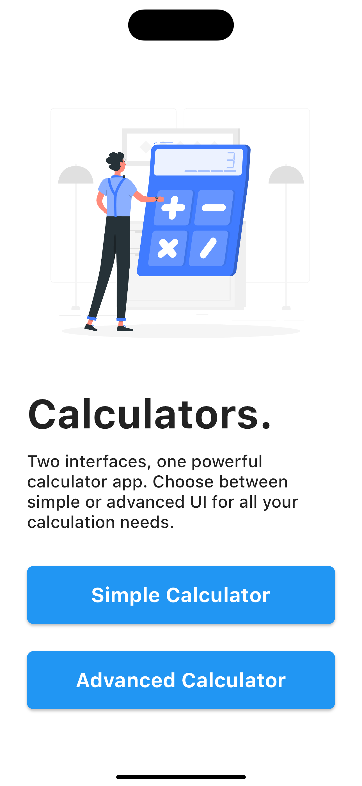
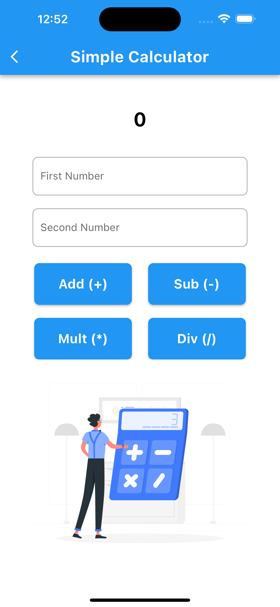
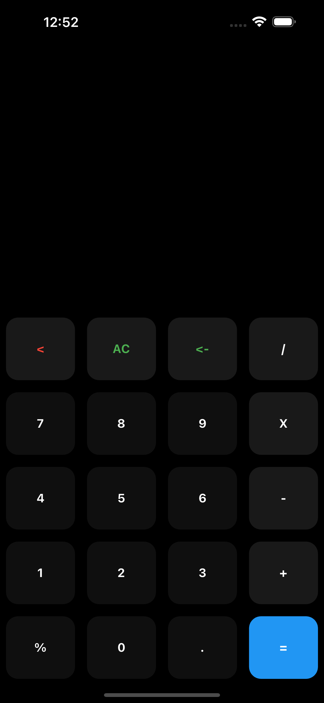

# Calculators

A new Flutter project.

Welcome to my versatile calculator app offering two distinctive interfaces: the sleek simplicity of the basic UI and the advanced functionality of the advanced UI. Tailored to fit your needs, whether you prefer straightforward calculations or crave advanced features, our app provides the perfect solution for all your calculation requirements. Experience the convenience of both worlds in one powerful app!

## Output

<b>Home Page</b> 
 

<b>Simple Calculator</b> 
 

<b>Advanced Calculator</b> 
 

<!-- <table>
    <tr>
        <td><b>iOS</b></td>
        <td><b>Android</b></td>
    </tr>
    <tr>
        <td></td>
        <td></td>
    </tr>
</table> -->

## Getting Started

This project is a starting point for a Flutter application.

A few resources to get you started if this is your first Flutter project:

- [Lab: Write your first Flutter app](https://docs.flutter.dev/get-started/codelab)
- [Cookbook: Useful Flutter samples](https://docs.flutter.dev/cookbook)

For help getting started with Flutter development, view the
[online documentation](https://docs.flutter.dev/), which offers tutorials,
samples, guidance on mobile development, and a full API reference.
