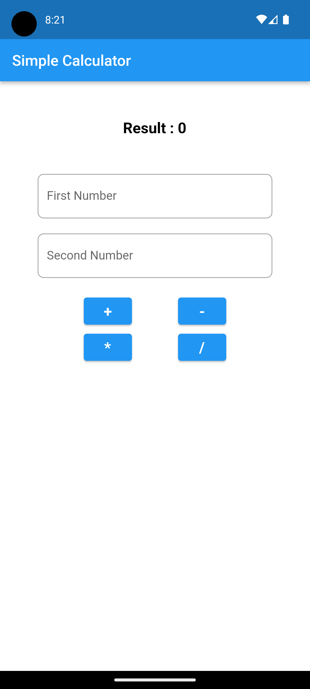

# simple_calculator

A new Flutter project.

## Getting Started

This project is a starting point for a Flutter application.

A few resources to get you started if this is your first Flutter project:

- [Lab: Write your first Flutter app](https://docs.flutter.dev/get-started/codelab)
- [Cookbook: Useful Flutter samples](https://docs.flutter.dev/cookbook)

For help getting started with Flutter development, view the
[online documentation](https://docs.flutter.dev/), which offers tutorials,
samples, guidance on mobile development, and a full API reference.

### Output

<table>
    <tr>
        <td><b>iOS</b></td>
        <td><b>Android</b></td>
    </tr>
    <tr>
        <td></td>
        <td></td>
    </tr>
</table>
